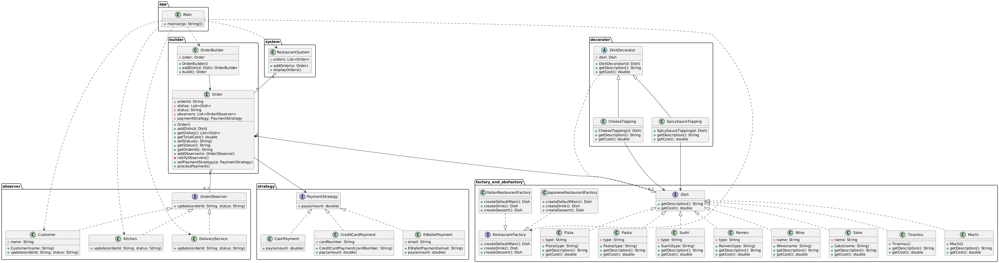

# Restaurant Management System
### Implemented Using Design Patterns (Factory, Abstract Factory, Decorator, Observer, Builder, Strategy)

This project is a console-based Restaurant Management System written in Java.
It demonstrates how multiple Object-Oriented Design Patterns can work together within a cohesive and modular architecture.

# Features
### Cuisine Selection

Italian

Japanese

### Order Builder

Users can add any number of:

Main dishes

Drinks

Desserts

### Toppings (Decorator Pattern)

Cheese

Spicy sauce

Both

None

### Multiple Payment Methods (Strategy Pattern)

Credit card

Cash

E-wallet

### Observer Notifications

Order status changes automatically notify:

Customer

Kitchen

Delivery service

### Statuses include:

Received

Preparing

Ready

Out for delivery

Delivered

## Design Patterns Overview
### Factory Pattern

Responsible for creating specific dish objects such as:

Pizza, Pasta

Sushi, Ramen

### Abstract Factory Pattern

Defines entire cuisine menus:

ItalianRestaurantFactory

JapaneseRestaurantFactory

Each factory produces:

Main dish

Drink

Dessert

### Decorator Pattern

Adds toppings dynamically without modifying base dish classes:

CheeseTopping

SpicySauceTopping

### Builder Pattern

Constructs a complete Order step-by-step, allowing flexible composition of dishes.

### Observer Pattern

Multiple observers react to order status changes:

Customer receives updates

Kitchen receives preparation alerts

Delivery service receives readiness/delivery notifications

### Strategy Pattern

Allows runtime selection of payment methods:

CreditCardPayment

CashPayment

EWalletPayment

## Diagram

## Conclusion

This project demonstrates how several classic software design patterns can be combined to create a modular, maintainable, and extensible restaurant management system.
It serves as a practical example for students and developers learning real-world object-oriented design.